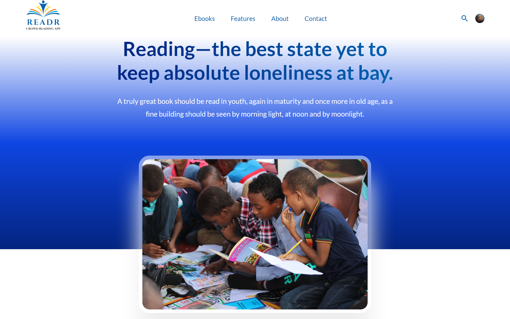
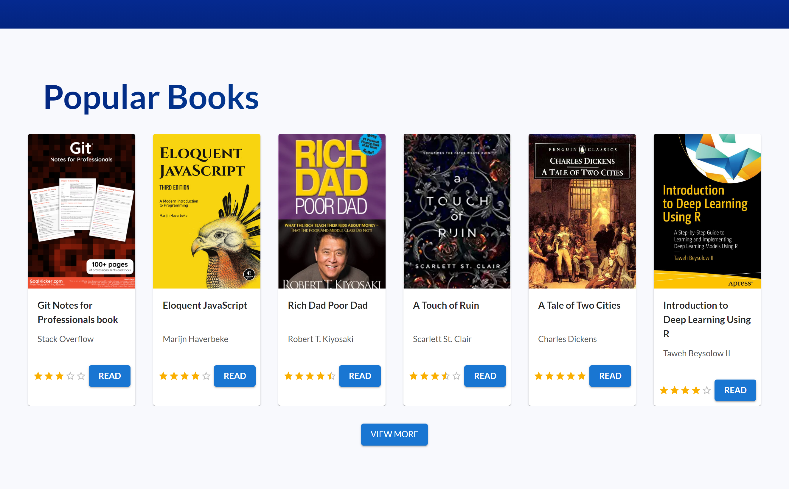
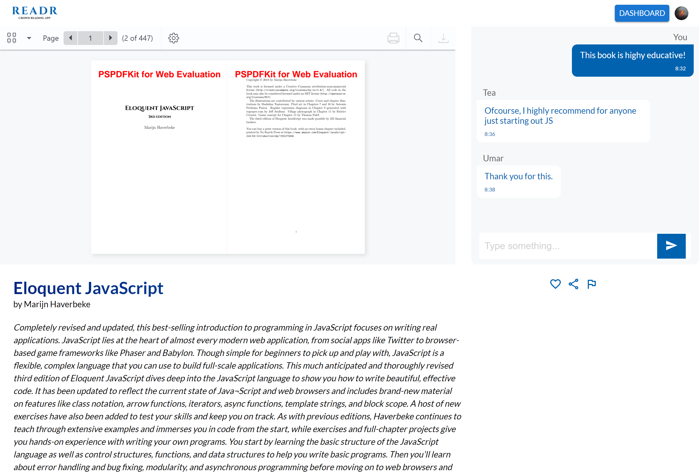

# READR - A Social reading app

Readr is a social reading application for sharing your reading
experience with friends family and co-workers. Allows you chat
with your loved ones about the book you're reading. Enrich
your reading experience and strengthen your relationships. With this, it allows you stay consistent with reading.

## Table of contents

-  [Overview](#overview)
   -  [The challenge](#the-challenge)
   -  [Screenshot](#screenshot)
   -  [Links](#links)
-  [My process](#my-process)
   -  [Built with](#built-with)
   -  [Continued development](#continued-development)
-  [Author](#author)
-  [Acknowledgments](#acknowledgments)

## Overview

### The challenge

Technology is taking over every aspect of the world. E-books are becoming the standard. Studies have shown that having book clubs and reading discussions increases commitments and helps keep you accountable to reading.

So I came up with a project idea that allows you stay consistent with reading by sharing your experiences and progress with other fellow readers. I discovered that having a community for a particular book helps one to concentrate better. This is the idea conceived here.

Users should be able to:

-  Sign up/ Login sucessfully either with the Google sign-in or with the conventional username and password method
-  View the Ebooks page consisting of all the books present in the app
-  Sucessfully search a book title or book author
-  Sucessfully chat with other readers while viewing the ebook you clicked
-  Navigate to the dashboard to view the list of books you are currently reading.

### Screenshot

### Links

-  Solution URL: [Github repo](https://github.com/jibreel1/readr)
-  Live Site URL: [READR app](https://crowd-readr.netlify.app/)

## My process

### Built with

-  Mobile-first workflow
-  [React](https://reactjs.org/) - JS library
-  [Firebase](https://firebase.google.com/) - For storing and diplaying my data in Realtime
-  [Material UI](https://mui.com/) - For styles and Carousel display
-  [SCSS](https://sass-lang.com/) - For styles
-  [PSPDFKit](https://pspdfkit.com/) - For displaying the E-books
-  Context API

### Continued development

I plan to keep improving this app in the future. I will need to understand the concept of Redux as a state management tool for large scale projects. I will also need to undertand Typescript as it makes code cleaner and faster. Moving forward, I want to learn the above to prepare me for my Next.js journey in the nearest future.

## Author

-  Website - [My Portfolio](https://www.jbs-blueprint.me/my-portfolio/)
-  LinkedIn - [@jibreel-osunkoya](https://www.linkedin.com/in/jibreel-osunkoya/)
-  Twitter - [@Jubril1005](https://twitter.com/Jubril1005)

## Acknowledgments

I will like to appreciate my **brother and mentor**, Dev Mubaraq. May Allah continue to bless you. I will also like to thank the support team of [PSPDFKit](https://pspdfkit.com/), they were very prompt and eager to help on the problems I encountered using their product. I'd recommend their products to anyone willing to display PDFs for their projects, check them out!

Oluwaseun👩‍💻, Firdaws👩‍💻 and to all other devs who helped me on this project, I say this is just the start! Thank you!
